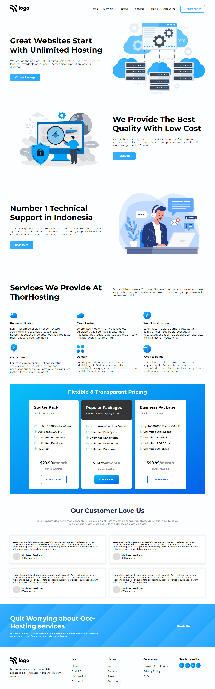
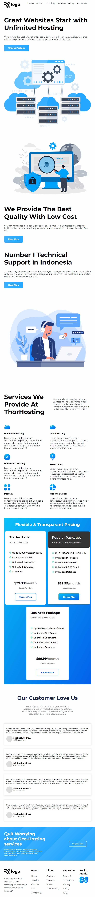

# PRANAV MATHUR

## Learnings from the project:

- Responsive layout design
- Working with SVG images

## Time taken:

    It took me a 2 days to complete this project, perfectly laying out SVG images took most of the time.

## Screenshots:

## Live link:

[Go to site](https://hosting-landing-page-011.netlify.app/)
